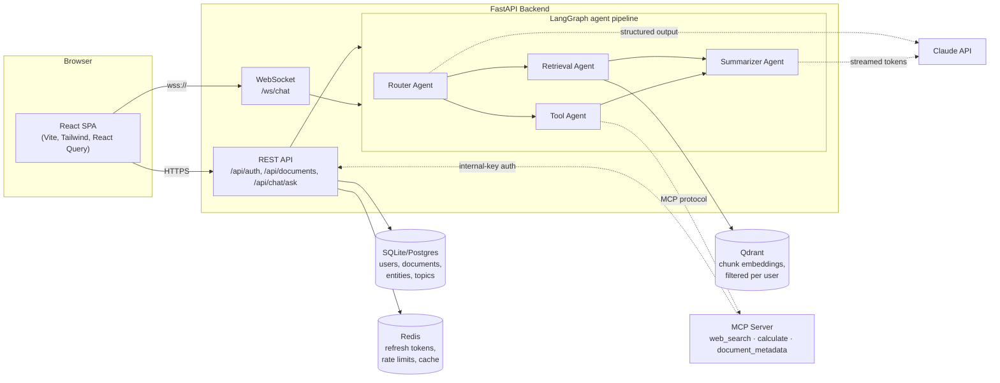

# IntelliDocs AI

[](https://github.com/shubhnb5/intellidocs-ai/actions/workflows/ci.yml)

**Multi-Agent Document Intelligence & Research Copilot.** Upload a document, then chat with it — a Router agent decides per question whether to search your documents (RAG), call live tools (web search, a calculator, document lookup — over a real MCP server), do both, or just answer directly, and a Summarizer agent composes the final, cited answer while you watch each agent's activity stream in over a WebSocket.

This is a portfolio project built to demonstrate real, working RAG / multi-agent orchestration / MCP / vector search / classical NLP / production-backend skills — not just the buzzwords. Every phase below was built with production-readiness (structured logging, centralized error handling, input validation, tests, CI) alongside the feature, not bolted on at the end.

## Quickstart

```bash
cp backend/.env.example backend/.env        # fill in ANTHROPIC_API_KEY at least
cp mcp-server/.env.example mcp-server/.env  # set JWT_SECRET_KEY / INTERNAL_API_KEY
                                             # to match the values in backend/.env
docker compose up -d --build
```

- Frontend: http://localhost:5173
- Backend API docs (OpenAPI/Swagger): http://localhost:8000/docs
- MCP server health: http://localhost:8001/health

Running each service directly on the host instead (no Docker) — see
[Local development](#local-development) below. Deploying it live — see
[DEPLOYMENT.md](DEPLOYMENT.md).

## Architecture



The agent graph's job stops at "gather context" (route + retrieved chunks +
tool results) — the Summarizer isn't a graph node, it's called directly
afterward by each endpoint, specifically so the WebSocket can stream its
answer token-by-token. See [ARCHITECTURE.md](ARCHITECTURE.md) for why.

## Tech stack

| Layer | Choice | Why (see ARCHITECTURE.md for the full trade-off) |
|---|---|---|
| LLM | Claude (Anthropic API), `AsyncAnthropic` | Native structured output, first-class async, generous extended-thinking controls |
| Vector DB | Qdrant, self-hosted via Docker | Real production vector DB with filtering (needed for per-user isolation), not just a prototyping library |
| Agent orchestration | LangGraph (`StateGraph`) | Explicit, inspectable graph with real conditional/parallel execution — not a linear chain |
| Tool protocol | MCP (Model Context Protocol), a real standalone server | Demonstrates the actual protocol, not a callback function pretending to be one |
| Embeddings | fastembed (local ONNX, `BAAI/bge-small-en-v1.5`) | No per-token cost or network round-trip during ingestion |
| Classical NLP | spaCy (NER, keyphrases) + hand-rolled TextRank | A second, non-LLM way to extract structure — deliberately not "ask Claude to summarize it" |
| Backend | FastAPI (REST + WebSocket) | Async-native, typed, one framework for both transports |
| Relational store | SQLAlchemy + SQLite | Zero-setup for a demo; a `DATABASE_URL` change away from Postgres |
| Auth | JWT access + rotating refresh tokens, bcrypt | Refresh tokens are Redis-allowlisted so they're actually revocable |
| Cache / rate limit | Redis | One primitive ("a key with a TTL") doing three jobs — see ARCHITECTURE.md |
| Frontend | React + Vite + Tailwind v4, React Query | React Query for REST; a hand-rolled hook for the WebSocket (not React Query's domain) |
| CI | GitHub Actions | Needs zero live infrastructure — every test fakes its external dependency |
| Deployment | Docker Compose (local), Render Blueprint (live) | Same environment-variable-driven config works unmodified in both |

## Local development

Each service runs independently; you need all three for the full app (plus
Qdrant and Redis, which only Docker is used for even in local dev — see
`docker-compose.yml`).

```bash
# Infra
docker compose up -d qdrant redis

# Backend
cd backend
python -m venv .venv && source .venv/bin/activate   # or .venv\Scripts\activate on Windows
pip install -r requirements-dev.txt
python -m spacy download en_core_web_sm
cp .env.example .env   # fill in ANTHROPIC_API_KEY
uvicorn main:app --reload

# MCP server (separate terminal)
cd mcp-server
pip install -r requirements-dev.txt
cp .env.example .env
python server.py

# Frontend (separate terminal)
cd frontend
npm install
npm run dev
```

## What you can actually do with it

1. **Register / log in** — email + password, JWT access + refresh tokens.
2. **Upload a PDF or DOCX** — parsed, chunked, embedded into Qdrant, and run
   through the NLP pipeline (entities, topics, an extractive summary) in one
   request. The document list shows all of it, expandable per document.
3. **Ask a question** — a Router agent decides the route:
   - *"What does the Q3 report say about revenue?"* → RAG (Qdrant retrieval)
   - *"What's 18% of 4,200?"* or *"What's the latest Qdrant release?"* → tools (MCP)
   - A question needing both → both agents run in parallel
   - *"What's the capital of France?"* → direct, no retrieval/tools at all
4. **Watch it work** — the agent activity panel streams Router → Retrieval/Tool
   → Summarizer live over the WebSocket, and the answer types itself out
   token-by-token as Claude generates it.

## Explain Like I'm New

Short, plain-English explanations of each concept this project uses — written
for the interview version of "can you explain what X actually is."

**RAG (Retrieval-Augmented Generation).** An LLM only knows what it was
trained on and whatever's in the current conversation — it's never seen your
uploaded document. RAG bridges that gap: chop the document into chunks,
convert each chunk into a vector (a list of numbers capturing its meaning),
store those vectors in a database built for fast similarity search, and at
question time, convert the *question* into a vector too and ask the database
for the most similar chunks. Those chunks get pasted into the prompt as
context, so the model answers from your actual document instead of guessing.

**Embeddings / vector search.** An embedding model turns text into a point in
high-dimensional space such that similar meanings end up near each other.
"Revenue grew" and "sales increased" land close together even though they
share no words. Qdrant's job is: given a query point, find the nearest
stored points fast, even across millions of them — this project uses cosine
similarity, which measures the angle between two vectors rather than their
raw distance.

**Multi-agent orchestration (LangGraph).** Instead of one prompt trying to do
everything, the work is split across specialized agents with a defined
control flow: a Router decides what's needed, Retrieval and Tool agents
gather it (in parallel when both are needed), and a Summarizer composes the
final answer. LangGraph represents this as a graph — nodes are agents, edges
are the (sometimes conditional) transitions between them — which makes the
control flow inspectable and testable instead of a tangle of if/else
branches.

**MCP (Model Context Protocol).** A standard way for an LLM application to
discover and call external tools, independent of which model or app is
calling them — the same idea as a REST API standardizing how web clients
talk to servers. This project runs a real, separate MCP server exposing
three tools (web search, a calculator, document lookup) that the backend
connects to as an ordinary MCP client, over the actual protocol, not a
function call dressed up to look like one.

**Classical NLP vs. LLM.** Named entity recognition (spaCy) and TextRank
summarization are older, non-LLM techniques — no API call, no per-request
cost, fully deterministic. They're included specifically to show a different
skill than "prompt an LLM to do X": spaCy's NER model was trained
specifically to recognize people/orgs/dates, and TextRank builds a
similarity graph between sentences and ranks them the same way Google ranks
web pages (PageRank), picking the most "central" sentences as the summary.

**JWT auth with refresh rotation.** A JWT is a signed token the server can
verify without a database lookup — fast, but that speed is exactly why it
can't be un-issued before it expires. This project's access tokens are
short-lived JWTs (stateless, fast), while refresh tokens are tracked in
Redis and **rotate** on every use: each refresh deletes the old one and
issues a new pair, so a stolen refresh token only works once before the
legitimate client's next refresh fails — a real signal something's wrong,
not just a longer-lived risk window.

**Redis as a general primitive, not just a cache.** Redis is really just "a
key with an optional TTL, fast." This project uses that one primitive for
three different jobs: the refresh-token allowlist above, a fixed-window rate
limiter (`INCR` + `EXPIRE`), and a cache-aside layer on the document list
(short TTL as a backstop, explicit invalidation on upload as the real path).

**Docker / containerization.** Packaging an app with its exact dependencies
so it runs identically anywhere. The interesting part here isn't the
Dockerfiles — it's that every service's Qdrant/Redis/MCP-server URL comes
from an environment variable, so the *same* code runs correctly whether
those services are reachable at `localhost`, a Docker Compose service name,
or a Render private-network hostname, without a single code change.

## Talking points for interviews

A curated set of the questions this project is most likely to invite, with
answers scoped to 2-3 sentences — the ARCHITECTURE.md has the longer version
of each.

- **"Why Claude over OpenAI?"** Native structured-output validation via
  `messages.parse()`, first-class async client so agent nodes never block
  the event loop, and per-request extended-thinking effort control that
  lets me trade cost/latency against quality per agent (the Router doesn't
  need the same depth as the Summarizer).
- **"Why Qdrant over Chroma/Pinecone?"** Chroma is great for prototyping but
  I wanted a vector DB with production-grade filtering — this project
  actually depends on that: per-user document isolation is a Qdrant
  `Filter` on `owner_id` at query time, not an application-layer
  after-the-fact filter.
- **"Why LangGraph over just calling functions in sequence?"** The routing
  is genuinely conditional and sometimes parallel (the "both" route runs
  Retrieval and Tool in the same superstep) — expressing that as a graph
  with conditional edges makes the control flow declarative and
  inspectable (`graph.get_graph().draw_mermaid()`), not a chain of
  hand-written if/else buried in a function.
- **"Walk me through what happens when I ask a question."** Question hits
  either the REST endpoint or the WebSocket → the compiled LangGraph
  `ainvoke`s (or `astream`s) starting at the Router node → Router calls
  Claude for a structured `{route, reasoning}` decision → conditional edges
  fan out to Retrieval (Qdrant, filtered to your documents) and/or Tool
  (calls the MCP server, which itself may call Claude to decide *which*
  tool) → once the graph reaches `END`, the Summarizer (not a graph node)
  streams the final answer from whatever context was gathered.
- **"How do you know your tests actually mean something if you can't run
  Python locally?"** Every external dependency — Qdrant, Claude, the MCP
  client, Redis — is faked at the exact point the code imports it
  (`monkeypatch.setattr(module, "name", fake)`), so the test suite has run,
  just via GitHub Actions rather than my own machine; the discipline of
  faking at the import boundary is what let CI need zero live
  infrastructure to prove ~1,400 lines of tests actually pass.
- **"What's the biggest thing you'd change for a real production
  deployment?"** SQLite → Postgres (already a `DATABASE_URL` change, no
  code change) and the MCP server's `document_metadata` tool not carrying
  the original user's identity through the protocol hop — right now it
  authenticates as a trusted service rather than impersonating the asking
  user, which is a real, named scope gap, not an oversight.

## Testing

```bash
cd backend && pytest        # ~as many tests as routes/services/agents warrant
cd mcp-server && pytest
cd frontend && npm run build
```

Every backend/MCP-server test fakes its external dependency at the module
import boundary — no live Qdrant, Redis, Claude API key, or MCP server
needed. See [.github/workflows/ci.yml](.github/workflows/ci.yml), which runs
exactly this on every push with zero service containers.

## Project structure

```
backend/        FastAPI app — REST + WebSocket, LangGraph agents, auth, NLP
  main.py        entrypoint — run with `python main.py`
  src/core/      config, exceptions, error handlers, logging, auth, rate limiting
  src/db/        SQLAlchemy models, Qdrant client, Redis client
  src/routes/    auth_routes, document_routes, chat_routes, chat_websocket, health_routes
  src/services/  chunking, parsing, embeddings, NLP, LLM, MCP client, agent_*
mcp-server/    Standalone MCP server — web_search, calculate, document_metadata
frontend/      React + Vite + Tailwind — Auth, Documents, Chat, AppLayout
```

## More detail

- [ARCHITECTURE.md](ARCHITECTURE.md) — every design decision and trade-off,
  known limitations, and an enterprise-scale evolution path
- [DEPLOYMENT.md](DEPLOYMENT.md) — Docker Compose and Render deployment
  walkthroughs
